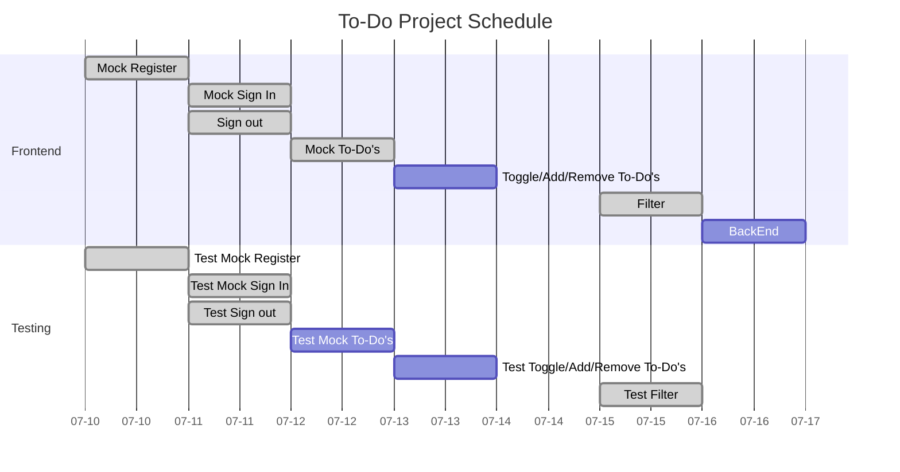

# ToDo App

This app should have the following features:

- [ ] Display a To-Do list created by the user
- [ ] The user should be able to add/remove To-Do's
- [ ] The user should be able to toggle To-Do's between completed/pending
- [ ] Sign in/out and Register feature
- [ ] Save To-Do's on the backend
- [ ] Filter To-Do's by all/completed/pending
- [ ] optional: add a deadline when creating a new To-Do 

### Week July 10th to July 16th
- [X] Create mock Register feature without a server
- [x] Create mock Sign In feature without a server
- [x] Create Sign Out option
- [x] Show mock To-Do's
- [ ] Toggle To-Do state (completed/pending)
- [x] Add/Remove To-Do
- [x] Create a filter (all/completed/pending)
- [ ] Integrate BackEnd

